# Router Lab
This lab was created to help me configure and test my homelab router configuration.

I opted for [terraform](https://terraform.io/) based lab because it would be easy to create and destroy. My hypervisor of choice was [libvirt](https://libvirt.org) with [QEMU](https://www.qemu.org)/[KVM](https://linux-kvm.org) backend. 

Terraform provider used: [dmacvicar/terraform-provider-libvirt](https://registry.terraform.io/providers/dmacvicar/libvirt/latest/docs) [GitHub](https://github.com/dmacvicar/terraform-provider-libvirt)

# Router Plan
## Test Lab Network Diagram

```mermaid
flowchart LR
    A{{"🌐 Internet"}} --- B(["🔥 Alpine Router"])
    B --- C(["🖥️ Ubuntu Desktop 1"]) & D(["🖥️ Ubuntu Desktop 2"])
```

<h2> Software</h2>

### Operating System: [Alpine Linux](https://alpinelinux.org)
due to minimalistic nature and ability to be ran from ram ([Diskless Mode](https://wiki.alpinelinux.org/wiki/InstallationDiskless_Mode)) ([lbu](https://wiki.alpinelinux.org/wiki/Lbu))

### DHCP: [ISC DHCP](https://www.isc.org/dhcp/)
it's battle tested and most well known while being fairly minimal (to the point that some distributions package it as just `dhcp` package).

### DNS: [BIND 9](https://www.isc.org/bind/)
another ISC product, while the same reasoning as above applies it's also the only mainstream DNS solution that supports DNSSEC, recursive DHCP lookup and dynamic DHCP host registration ([RFC 2136](https://www.rfc-editor.org/rfc/rfc2136))

### Certificate Authority: [step ca](https://smallstep.com/docs/step-ca)
provides ssh and X.509 certificate management with ACME protocol support.

### Firewall: [nftables](https://www.nftables.org/)([wiki](https://wiki.nftables.org/))
minimal Linux firewall, modern replacement for iptables.

### VPN: [Tailscale](https://tailscale.com/)
Allows for seamless connection with other servers (cloud or remote), will allow usage of common DNS on all nodes no matter of the locationta

# References
- [Setting up Alpine Linux as a Home Router](https://riedstra.dev/2022/02/alpine-linux-home-router)
- [Setup BIND9 with ISC-DHCP-SERVER dynamic host registration](https://talk-about-it.ca/setup-bind9-with-isc-dhcp-server-dynamic-host-registration/)
